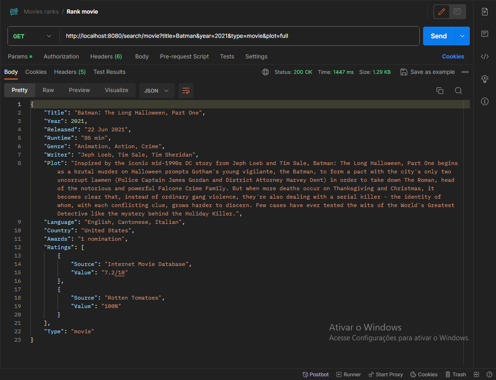

# MoviesRank
[](https://github.com/ualashenr/GameList/blob/master/LICENSE) 

# Sobre o projeto
MoviesRank é um projeto com o objetivo de retornar um resumo sobre um filme ou série de acordo com os parâmetros de busca escolhidos pelo usuário.

# Tecnologias utilizadas

## Back-end
* Java
* Spring
* Maven

# End Points

* `http://localhost:8080/search/movie`: End-point para procurar o filme.

## Parâmetros de busca

Os parâmetros de busca devem ser adicionados logo depois do End point. Começe com um ponto de interrogação(?) para aplicar o primeiro parâmetro, depois utilize & para adiconar outros parâmetros de busca.

* `title`: Busca pelo nome.
* `year`: Busca pelo ano de estreia.
* `type`: Específica se você está procurando um filme, série, ou episódio. Parâmetros permitidos: movie, series, episode.
* `plot`: Retorna uma descrição curta ou longa. Por padrão a descrição é curta, mas pode ser alterada utilizando os parâmetros: short ou full para resumida ou completa respectivamente.

# Postman Exemplo


# Como executar o projeto

## Back-end

Pré-requisitos: Java 17

```bash
# clonar repositório
git clone https://github.com/ualashenr/MoviesRank.git

# entrar na pasta do projeto back end
cd backend

# executar o projeto
./mvnw spring-boot:run
```
# Autor
Ualas Henrique Bezerra Filho

https://www.linkedin.com/in/ualas-henrique-54678827a/
